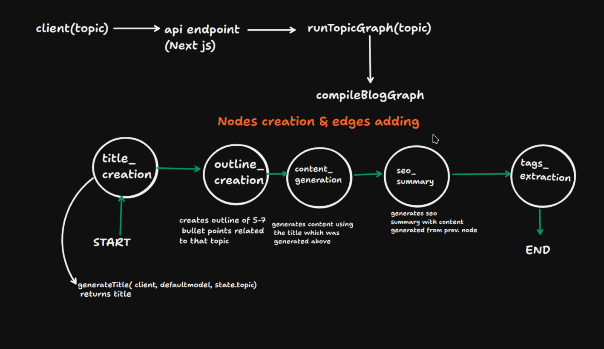

# AI Blog Generator (Next.js + TypeScript)

This is a full‑stack Next.js app that generates blog posts using GROQ. You type a topic, the server creates a title and a full Markdown article.

## Tech stack

- Next.js App Router (TypeScript)
- GROQ SDK (LLM)
- Zod (request validation)
- Tailwind CSS + simple animations (framer‑motion)
- Prisma ORM (with PostgreSQL, optional)

## How it works

1. The page has a simple form where you enter a topic.
2. The server API at `app/api/blogs/route.ts` validates the input with Zod.
3. A small “graph” function runs two steps: make a title, then make content.
4. The GROQ client calls the model (default: `llama-3.1-8b-instant`).
5. The page shows the generated title and Markdown content.

## Setup

1. Install deps:

```bash
pnpm install
```

2. Set your environment:

```bash
cp .env.example .env.local
# then edit .env.local and add your GROQ_API_KEY
```

3. (Optional) Set up a Postgres database and set `DATABASE_URL` in `.env.local`, then:

```bash
pnpm prisma generate
pnpm prisma db push
```

4. Run the app:

```bash
pnpm dev
```

Visit http://localhost:3000

## Environment variables

- `GROQ_API_KEY`: required for GROQ.
- `DATABASE_URL`: Postgres connection string (only if you want to save blogs).

## Where is the code?

- API route: `app/api/blogs/route.ts`
- Streaming API: `app/api/blogs/stream/route.ts`
- GROQ client: `lib/llm/groq.ts`
- Graph (LangGraph): `lib/graph/blogGraph.ts`
- Zod schema: `lib/validation/blog.ts`
- UI page: `app/page.tsx`

## What are “graphs” in this project?

A graph is a set of small steps (nodes) connected by edges that define the order of execution. We use LangGraph JS to model the workflow:

- Nodes in this app: `title_creation` → `outline_generation` → `content_generation` → `seo_summary` → `tags_extraction`.
- Each node receives the current state and returns updates (like the title or tags).
- This makes complex flows easier to reason about, test, and extend.

Real‑world uses:

- Multi‑step assistants (plan → search → write → review → publish)
- Retrieval‑Augmented Generation (retrieve docs → summarize → cite sources)
- Customer support bots (classify intent → route to tool → generate reply)
- Data cleanup pipelines (detect type → normalize → validate → export)

## What is “streaming” and why use it?

Streaming returns model output as it’s generated (token by token) instead of waiting for the full response. We use Server‑Sent Events (SSE) to push tokens to the browser.

- Benefits: faster feedback, better UX for long generations, easier to cancel or pause.
- In this app: `/api/blogs/stream` streams the title first, then the article tokens. The UI shows content as it arrives with Markdown + code highlighting.





Real‑world uses:

- Chat UIs and document writers that show text as it’s typed
- Code assistants that reveal code blocks progressively
- Live dashboards that show ongoing analysis (logs, metrics, search results)

## Notes

- The project focuses on being clear and simple. Files are small and easy to read.
- You can later add storage using Prisma and the `Blog` model if needed.
